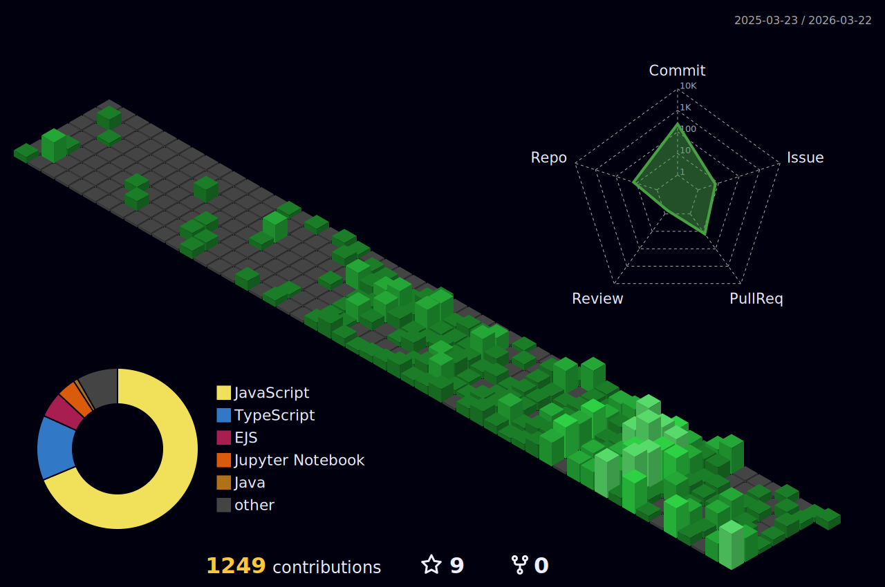

 
  
  

 

### 

I’m a **Computer Science graduate** specializing in scalable, production-ready development using **MERN**, **Next.js**, and **Django**. With strong **DSA fundamentals**, my focus is on clean architecture, performance, and reliable engineering.

Currently, I’m exploring **Agentic AI systems**—applications capable of autonomous reasoning, planning, and action—while integrating **Machine Learning** to build smarter, real-world solutions.

### 

<table align="center" width="100%">
  <tr>
    <th align="left">Platform</th>
    <th align="left">Achievements</th>
    <th align="left">Rankings</th>
  </tr>
  <tr>
    <td width="20%">LeetCode</td>
    <td width="40%">1450+ questions solved 🏆</td>
    <td width="40%">Max rating 1680+ 🌐 Top 20% Global</td>
  </tr>
  <tr>
    <td>GeeksforGeeks</td>
    <td>650+ questions solved 📚</td>
    <td>Institute Rank 1 🥇</td>
  </tr>
  <tr>
    <td>InterviewBit</td>
    <td>350+ questions solved 💼</td>
    <td>Ranked &lt; 7,000 globally out of 8,000,000 users 🌍</td>
  </tr>
  <tr>
    <td>HackerRank</td>
    <td>100+ questions solved 🖥️</td>
    <td>5-star Java Coder ⭐⭐⭐⭐⭐</td>
  </tr>
</table>

<!--

## 

## 
</img>
</img>
</img>
</img>
</img>
</img>
</img>
</img>
</img>
</img>
</img>
</img>
</img>
</img>
</img>
</img>
</img>
</img>
</img>
</img>
</img>
</img>
</img>
</img>

</img>
</img>
</img>
</img>
</img>
</img>

 
</img>
</img>
</img>
</img>
</img>
</img>
</img>

</img>
</img>
</img>
</img>
</img>
</img>
</img>
</img>
</img>
</img>
</img>
</img>
-->
  <!--- ------------------------------------------------------------------------------------------------------------------------------------------------------ -->
  <!--- -- About Tech  --------------------------------------------------------------------------------------------------------------------------------------- -->
  <!--- ------------------------------------------------------------------------------------------------------------------------------------------------------ -->

### 

<!-- Row 1: Frontend + Backend -->

  
  
  
  
  
  
  
  
  
  
  
  
  
  
  
  
  
  
  
  
  
  
  
  
  
  
  
  
  
  
  
  
  
  
  
  
  
  
  
  
  
  
  
  
  
  
  
  
  
  
  
  
  
  
  
  
  

### 
<table align="center">
  <tr>
    <td>
      
    </td>
    <td>
      
    </td>
  </tr>
</table>

<!--

-->

