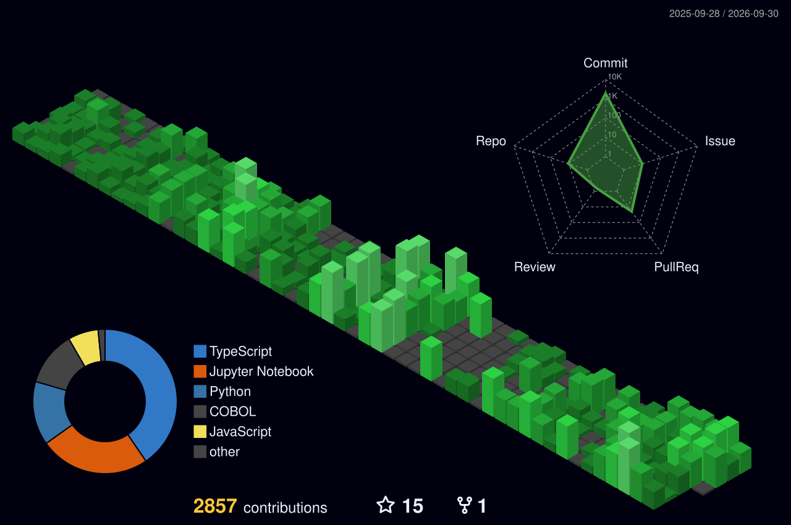

<table width="100%">
<tr>
<td width="75%" valign="top">

# Hey, I'm Harman Deep Singh

</td>

<td width="25%" align="right" valign="middle">

</td>
</tr>
</table>

---

## About Me

I’m a **Computer Science Engineer** who enjoys understanding how things work and turning that understanding into software.

As a kid, I was fascinated by games — wondering how a bike moves, how characters behave, and how an entire virtual world follows rules. That curiosity eventually pulled me deep into programming.

Over the years, I’ve spent a lot of time **learning, building, experimenting, and breaking things** — from DSA and software engineering to systems and newer technologies.

Currently exploring **ML/AI, RAG, Agentic systems, Go, and Rust**, while continuing to build projects and sharpen my problem-solving skills.

**Still curious. Still experimenting. Still building.**

---
### Achievements & Currently Exploring

Strong in **DSA and problem solving**, with **1450+ LeetCode problems solved**, a **1680+ peak rating**, and a **500+ day streak**. Also completed **650+ problems on GeeksforGeeks** with **Institute Rank 1**, and **350+ on InterviewBit**.

Currently exploring **ML/AI, RAG, LLM applications, and AI Agents**, while deepening my knowledge of **backend systems, system design, APIs, Linux, networking, and DevOps**. Exploring **Java, Python, Go, and Rust** through projects and experiments.

> Build. Break. Understand. Improve.

<!--

## 
</img>
</img>
</img>
</img>
</img>
</img>
</img>
</img>
</img>
</img>
</img>
</img>
</img>
</img>
</img>
</img>
</img>
</img>
</img>
</img>
</img>
</img>
</img>
</img>

</img>
</img>
</img>
</img>
</img>
</img>

 
</img>
</img>
</img>
</img>
</img>
</img>
</img>

</img>
</img>
</img>
</img>
</img>
</img>
</img>
</img>
</img>
</img>
</img>
</img>
-->
  <!--- ------------------------------------------------------------------------------------------------------------------------------------------------------ -->
  <!--- -- About Tech  --------------------------------------------------------------------------------------------------------------------------------------- -->
  <!--- ------------------------------------------------------------------------------------------------------------------------------------------------------ -->

### 

<!-- Row 1: Frontend + Backend -->

  <!-- Languages -->
  
  
  
  
  
  
  

  <!-- Frontend -->
  
  
  
  
  

  <!-- Backend -->
  
  
  
  
  
  
  
  
  
  
  
  
  
  
  
  
  
  
  
  
  
  
  
  
  
  
  
  
  
  
  
  
  

### 
<table align="center">
  <tr>
    <td>
      
    </td>
    <td>
      
    </td>
  </tr>
</table>

<!--

-->

